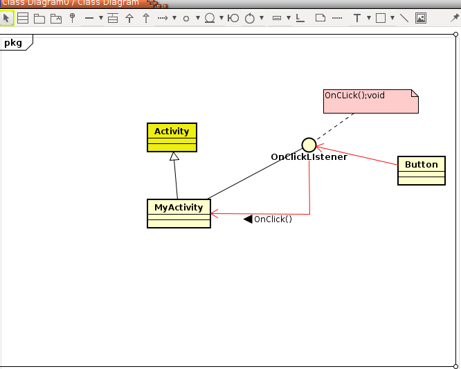

# 架构设计的UML图形思考  

#### Astah社区版本

---

#### UML类型与接口

在oop里，将接口定义位一种特殊的类型  
如果一个类别的某些函数是抽象函数，就称为抽象函数  
如果一个类型，他的所有函数全部都是抽象函数的话，就称为纯粹抽象类，这种特殊类型又被称为接口  

在C++里
一般类型（所有函数都不是虚函数）  
虚类(又一个或者多个虚函数)  
纯虚类(所有函数都是抽象或者virtual void function() = 0;)
