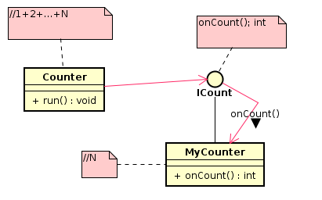
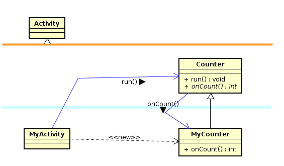
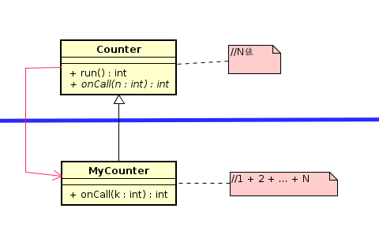

---


---
```java
//Counter.java
package myframework;

public abstract class Counter{
  public int run(){
    int N;
    N = this.onCount();
    int sum = 0;
    for(int i = 1;i <= N; i++){
      sum += i;
    }
    return sum;
  }
  public abstract int onCount();
}

```
---
```java
public class MyCount extends Counter{
  public int onCount(){
    return 10;
  }
}
```
---
```java
public class MyActivity extends Activity{
  @override
  protected void onCreate(Bundle icicle){
    super.onCreate(icicle);
    counter = new Counter();
    int sum = counter.run();
    setTitle("sum = " + String.valueOf(sum));
  }
}
```

# 例子2


---
```java
public abstract class Counter{
  public int run(){
    int N = getCount();
    return onCall(N);
  }
  public int getCount(){
    return 10;
  }
  protected abstract int onCall(int n);
}
````
---
```java
public class MyCounter extends Counter{
  @override
  protected int onCall(int n){
    int sum = 0;
    for (int i = 1; i <= n; i++) {
      sum += i;
    }
    return sum;
  }
}
```
---
```java
public class MyActivity extends Activity{
  @override
  protected void onCreate(Bundle sav){
    super.onCreate(sav);
    counter = new MyCounter();
    int sum = counter.run();
    setTitle("sum = " + String.valueOf(sum));
  }
}
```
