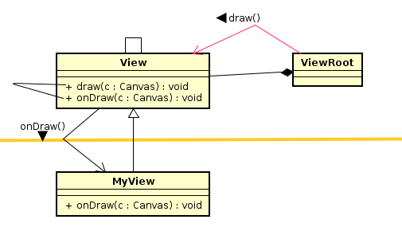

# TM模式（外包模式）



---
```java
public class MyView extends View{
  private Paint paint = new Paint();
  private int line_x = 100,line_y = 100;
  private float count = 0;

  MyView(Context ctx){
    super(ctx);
  }

  @override
  protected void onDraw(Canvas canvas){
    super.onDraw(canvas);
    if(count > 12)
      count = 0;
    int x = (int)(75.0 * Math.cos(2 * Math.PI * count / 12.0));
    int y = (int)(75.0 * Math.sin(2 * Math.PI * count / 12.0));
    count++;
    canvas.drawColor(Color.WHITE);
    canvas.setColor(Color.BLACK);
    canvas.setStrokeWidth(3);
    canvas.drawLine(line_x,line_y,line_x + x,line_y + y,paint);
    paint.setStrokeWidth(2);
    paint.setColor(Color.RED);
    canvas.drawRect(line_x - 5,line_y - 5,line_x + 5,line_y + 5,paint);
    paint.setColor(Color.YELLOW);
    canvas.drawRect(line_x - 3,line_y - 3,line_x + 3,line_y = 3,paint);
  }
}
```
---


---
```java
public class MyView extends View{
  private Paint paint = new Paint();
  private int line_x = 100,line_y = 100;
  private float count = 0;

  MyView(Context ctx){
    super(ctx);
  }

  @override
  protected void onDraw(Canvas canvas){
    super.onDraw(canvas);
    if(count > 12)
      count = 0;
    int x = (int)(75.0 * Math.cos(2 * Math.PI * count / 12.0));
    int y = (int)(75.0 * Math.sin(2 * Math.PI * count / 12.0));
    count++;
    canvas.drawColor(Color.WHITE);
    canvas.setColor(Color.BLACK);
    canvas.setStrokeWidth(3);
    canvas.drawLine(line_x,line_y,line_x + x,line_y + y,paint);
    paint.setStrokeWidth(2);
    paint.setColor(Color.RED);
    canvas.drawRect(line_x - 5,line_y - 5,line_x + 5,line_y + 5,paint);
    paint.setColor(Color.YELLOW);
    canvas.drawRect(line_x - 3,line_y - 3,line_x + 3,line_y = 3,paint);
    try {
      Thread.sleep(1000);
    }catch (Exception e) {
      invalidate();
    }
  }
}
```

# Factory Mode(工厂模式)


```java
public class GraphicView extends View{
  ...
}

public class activity01 extends Activity{
  private GraphicView gv = null

  @override
  public void onCreate(Bundle sav){
    super.onCreate(sav);
    gv = new GraphicView(this);
    setContentView(gv);
  }
}
```
---

# Observer mode(观察者模式)


```java
public class activity01 extends Activity implements onClickListener{
  private GraphicView gv = null

  @override
  public void onCreate(Bundle sav){
    super.onCreate(sav);
    setContentView(R.layout.main);
    Button btn = new Button(this);
    btn.setText("OK");
    btn.setBackgroundResource(R.drawable.heart);
    btn.setOnClickListener(this);
    setContentView(btn);
  }

  @override
  public void onClick(View v){
    String name = ((Button)v).getText().toString();
    setTitle(name + "button clicked");
  }
}
```

---

# Composite mode(组合模式)


```java
//MainActivity onCreate
  LineLayout layout = new LinearLayout(this);
  layout.setOrientation(LinearLayout.VERTICAL);
  et = new Edit(this);
  LinearLayout.LayoutParams params = new LinearLayout.LayoutParams(FP,WC);
  layout.addView(et,param);
  ...
  setContentView(layout);
```
