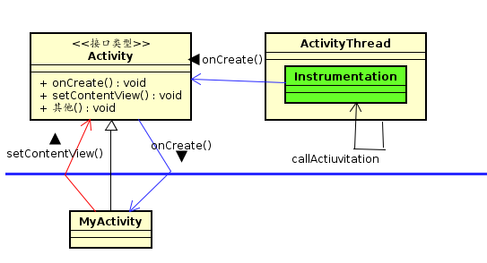
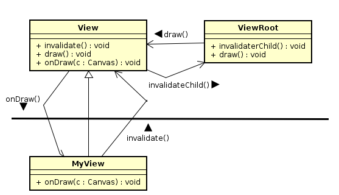
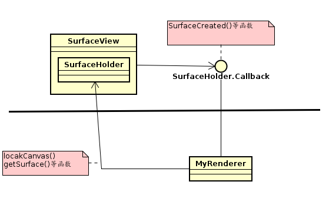
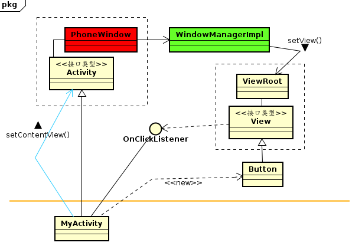

# 例子1


---
#例子2


```java
//MyView.java
public class MyView extends View{
  private Paint paint = new Paint();
  private int line_x = 100,line_y = 100;
  private float count = 0;

  MyView(Context ctx){
    super(ctx);
  }

    @override
    protected void onDraw(Canvas canvas){
      canvas...;
    }
}
```

---
# 例子3


```java
//MyRenderer.java
class MyRenderer implments SurfaceHolder.Callback{
  private SurfaceHolder surfaceHolder;
  private DrawThread drawThread;

  public void surfaceCreated(SurfaceHolder holder){
    surfaceHolder = holder;
    drawThread = new DrawThread();
    drawThread.start();
  }

  public void surfaceDestroyed(SurfaceHolder holder){
    drawThread.finish();
    drawThread = null;
  }

  public void surfaceChanged(SurfaceHolder holder,int format,int w,int h){

  }

  //---------------------------------------
  class DrawThread extends Thread{
    int degree = 0;
    boolean isFinish = false;

    DrawThread(){
      super();
    }

    @override
    public void run(){
      while (!isFinish) {
        Canvas canvas = surfaceHolder.lockCanvas();
        ...
        surfaceHolder.unlockCanvasAndPost(canvas);
        Thread.sleep(100);
      }
    }

    public void finish(){
      isFinish = true;
    }
  }
}

//Activity.java
onCreate(){
  ...
  Surface view = new SurfaceView(this);
  MyRenderer renderer = new MyRenderer();
  view.getHolder.addCallback(renderer);
  ...
}

```

---
# 例子4


此Android框架中有三个重要的EIT造型  
1. {PhoneWindow,Activity,MyActivity}  
2. {ViewRoot,View,Button}  
3. {View,OnClickListener,MyActivity}


三个EIT造型的互动过程:  

1. 首先Android框架诞生MyActivity轮胎，并且把它装配到PhoneWindow引擎上  
2. PhoneWindow引擎透过Activity接口呼叫MyActivity轮胎；要求它来诞生Button轮胎，并且把自己（MyActivity）的OnClickListener接口装配到Button轮胎里。  
3. MyActivity呼叫setContentView()函数来将Button轮胎接口传递给PhoneWindow引擎。  
4. PhoneWindow 引擎再把Button轮胎接口传递给WindowManagerImp,委托它来装配到ViewRoot引擎上，此时，轮胎都装配好了，UI画面也显示了。  
5. 用户就能触摸UI画面的按钮（Button轮胎）,触发了UI事件，Android框架就把事件传送给了ViewRoot引擎。   
6. ViewRoot引擎透过View接口而呼叫到Button轮胎。  
7. Button轮胎就透过OnClickListener接口来呼叫MyActivity轮胎的OnClick函数。
