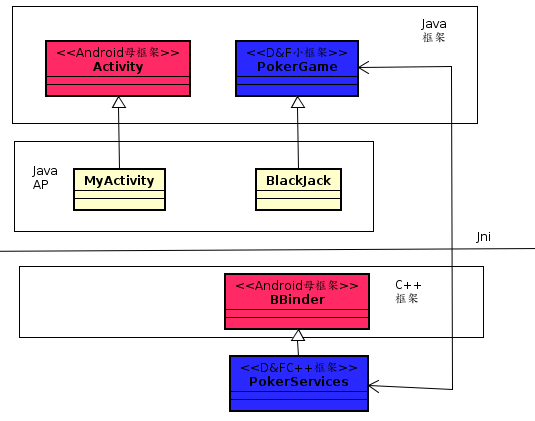
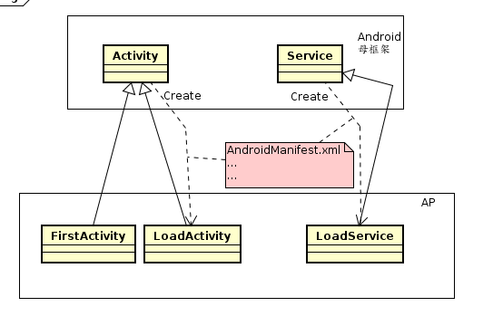
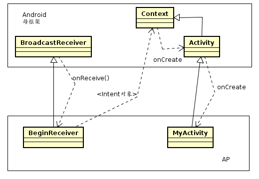

# 1

著名的eclipse和Android框架都是Java/C++双层框架


```java
//FistActivity.Java
public class FirstActivity extends Activity implements OnItemClickListener{

  //IOC 框架调用
  @override
  public void onCreate(Bundle cc){
      ...
      //正常调用
      startActivity(...)
  }


  //IOC 框架调用
  @override
  protected void onActivityResult(int request,int r,Intent data){
      ...
      //正常调用
      startActivity(...);
  }

}
```
---

# 4个嫡系基类  
1. Activity 处理UI互动的事情
2. Service 幕后服务
3. BroadcastReceiver 接受讯息及事件
4. ContentProvider 存储共享数据



---
# Intent-based Programming技术



```java
//BeginReceiver
public class BeginReceiver extends BroadcastReceiver{

  @override
  public void onReceive(Content content,Intent intent){
    Intent intent = new Intent(content,MyActivity.class);
    intent.addFlags(Intent.FLAG_ACTIVITY_NEW_TASK);
    startActivity(intent);
  }
}
```

---
# 四大组件之间的相互启动关系

# 认识ContentProvider
