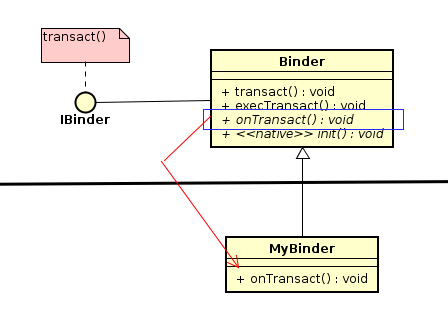
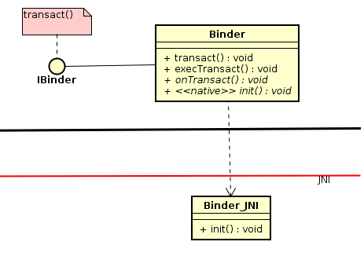
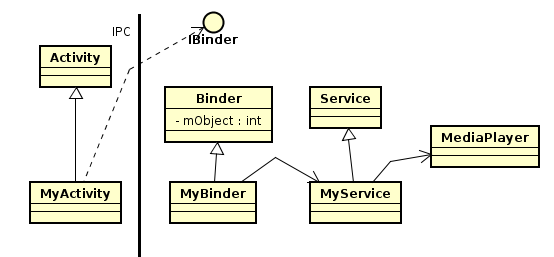
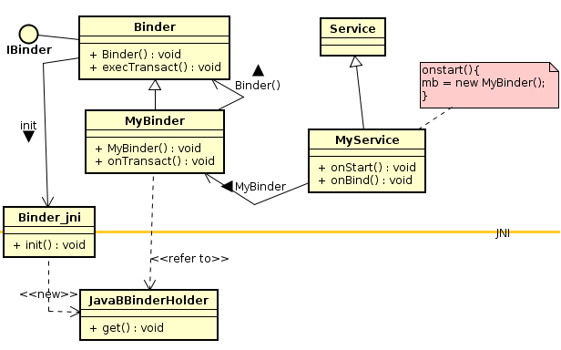
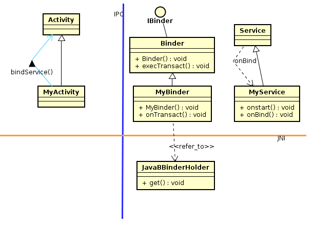
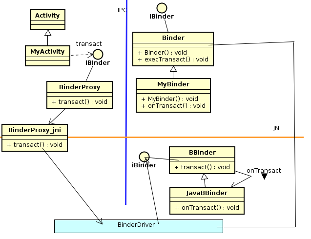

# 1什么是IPC通信？  

IPC是值跨越进程通信  
短程通信--在同一个进程中执行  

---
# 2复习Android的进程概念  

Android应用程序进程包含：
1. 一个VM对象
2. 主线程
3. MQ
4. Looper  

不同进程的空间地址是独立的  

---
# 设定IPC通信--使用AndroidManifest.xml文件

android:process=":remote"

---
# IPC的IBinder接口--定义与实现

Android框架的IPC沟通仰赖单一的IBinder接口，此时Client端调用IBinder接口的transact()函数，透过IPC机制而调用到远方(remote)的onTransact()函数  
Binder基类的很重要的目的是支持跨进程调用Service,也就是让远程的Client可以跨进程调用某个Service  

Binder基类的主要函数：  
1. transact()函数  --用来实作IBinder的transact()函数接口  
2. execTransact()函数  --角色与transact函数是相同的，只是这个用来让c/c++本地程序来调用的。  
3. onTransact()函数 --这是一个抽象函数，上述的transact和execTransact函数都是调用onTransact()函数来实现反向调用IOC  
4. init()函数 --这是一个本地函数，JNI模块来实现这个函数。



---
Init()是EIT造型的另外一种特殊接口，其支持<从Java到本地C>之间的调用接口  


---
### Java层的BinderProxy基础定义


1. 当我们看到类名是XXXProxy时，就自然会联想到它是摆在Client进程里，担任Service端的分身(Proxy)  
2. 由于跨进程沟通时，并不是从Java层直接沟通的，而是透过底层的Binder Driver驱动来沟通的，所以Client端的Java类别(如Activity)必须透过BinderProxy分身的IBinder接口，转而调用JNI本地模块来衔接到底层Binder Driver 驱动服务，进而调用到正在另一个进程里执行的Service.  
3. 当Client透过IBinder接口而调用到BinderProxy的transact()函数，就调用到其JNI本地模块的transact函数，就能衔接到底层的Binder Driver驱动服务了。  

---
# 5使用IBinder接口

举个例子，有一个Activity类别，它想跨进程去调用MediaPlayer播放引擎，以便播放音乐  



---
# 6.IPC通信三步骤
按照上面的例子  
其IPC通信的三个步骤：  
1. Activity使用startActivity函数来启动Service  
2. Activity调用bindService来绑定Service，Activity建立与Service之间的连接(Connection)  
3. Activity调用IBinder接口的transact()函数，透过底层Binder Driver驱动而间接调用Binder基类的execTransact函数，转而调用MyBinder的onTransact函数  

```java
//MyActivity.Java
public class MyActivity extends Activity implements OnClickListener{
  private ServiceConnection mConnection = new ServiceConnection(){
    public void onServiceConnected(ComponentName className,IBinder ibinder){
      mb = ibinder;
    }
  };
  public void onCreate(Bundle sss){
    startService(new Intent("xxx"));
    bindService(new Intent("xxx"),mConnection,Context.BIND_AUTO_CREATE);
  }
}
//MyService.Java
public class MyService extends Service{
  private IBinder mb = null;

  @override
  public void onStart(){
    mb = new MyBinder();
  }

  @override
  public IBinder onBind(Intent intent){
    return mb;
  }
}

//MyBinder.java
public class MyBinder extends Binder{

  @override
  public boolean onTransact(int code,Parcel data,Parcel replay,int flags){

  }
}

```

# 步骤1.调用startService()  
1. 当MyActivity调用startService时，就调用了Service.onStart()函数，执行到指令 mb = new MyBinder();  
2. 接着，调用MyBinder构造函数，进而调用父类别Binder()构造函数，转而调用JNI本地init函数。  
3. 此刻执行init函数，会在c/c++层诞生一个JavaBBinderHolder类别的对象，并且将这个JavaBBinderHolder对象的指针存入MyBinder对象里，让MyBinder对象指向JavaBBinderHolder对象。


---
# 步骤2.调用bindService()
1. 目前，已经执行玩startService函数了，接着，MyActivity继续调用bindService函数，想去绑定Service服务，如果找到该服务，且它尚未被任何Client绑定的话，就会执行Myservice的onBind函数，此时，执行到指令：return mb;  
2. onBind函数将mb(即MyBinder对象的IBinder接口)回传Android框架(其实是框架里的AMS(ActivityManagerService)).  
3. 当AMS接到回传的MyBinder对象指针(即其IBinder接口),就可以找到其在c/c++层所对应的JavaBBinderHolder对象，接着，又调用JavaBBinderHolder的get函数去诞生一个JavaBBinder对象。  
4. 接着，AMS在Client端进程的Java层里诞生一个BinderProxy对象来代表JavaBBinder的分身，也就是代表了MyBinder的分身，最后将BinderProxy的IBInder接口回传给MyActivity。  




---

# 7.远程VS近程通信
//使用Service更新Activity中的UI

近程通信（不跨进程）
```java
//IListener.java
public interface IListener{
  public void update(String s);
}

//Activity01
public class act01 extends Activity{
  onCreate(){
    MyService.setUpdateListener(new UpdateUIListener());
    startService();
  }

  class UpdateUIListener implements IListener{
    public void update(String s){
      tx.setText("" + s);
    }
  }
}

//Myservice.java
public class Myservice extends Service{
  private static IListener lis;
  private static int  k = 0;
  private Timer timer = new Timer();
  public Handler handler = new Handler(){
    public void handMessage(Message msg){
      lis.update("");
    }
  }

  public static void setUpdateListener(IListener lis){
    this.lis = lis;
  }

  oncreate(){
    TimerTask task = new TimerTask{
      @override
      public void run(){
        handler.sendEmptyMessage(0);
      }
      timer.schedule(task,1000,4000);
    }
  }
}
```

远程通信  
//例子：通过Activity控制Service播放MP3  
主界面从上到下有三个按钮 播放 暂停 退出

```java
//MainActivity.java
public class MainActivity extends Activity implements OnClickListener{
  private Button btn1,btn2,btn3;
  private IBinder ib = null;

  onCreate(){
    btn1-3.setOnClickListener(this);
    startSerive();
    bindService(...,connection,Context.BIND_AUTO_CREATE);
  }

  private ServiceConnection connection = new ServiceConnection{
    public void onServiceConnected(ComponentName className,IBinder ibinder){
      ib = ibinder;
    }

    public void onServiceDisconnected(ComponentName ComponentName){
    }
  }

  public void onClick(View v){
    case btn1:
      Parcel pc = Parcel.obtain();
      Parcel pc_replay = Parcel.obtain();
      pc.writeString("playing");
      try {
        ib.transact(1,pc,pc_replay,0);
      }catch(Exception e){

      }
      break;
    case btn2:
      Parcel pc = Parcel.obtain();
      Parcel pc_replay = Parcel.obtain();
      pc.writeString("stop");
      try {
        ib.transact(2,pc,pc_replay,0);
      }catch(Exception e){

      }
      break;
    case btn3:
      break;
  }
}

//MyService.java
public class MyService extends Service{
  private IBinder binder = null;

  onCreate(){
    binder = new MyBinder(this);
  }

  onBind(Intent intent){
    return binder;
  }
}

//MYBinder.java
public class MyBinder extends Binder{
  private MediaPlayer player = null;
  private Context ctx;
  MyBInder(Context ctx){
    this.ctx = ctx;
  }

  @override
  public boolean onTransact(int code,Parcel data,Parcel replay,int flags){
    replay.write(data.readString() + "mp3");
    if(code == 1){
      this.play();
    }else if(code == 2){
      this.pause();
    }
    return true;
  }
}
```
