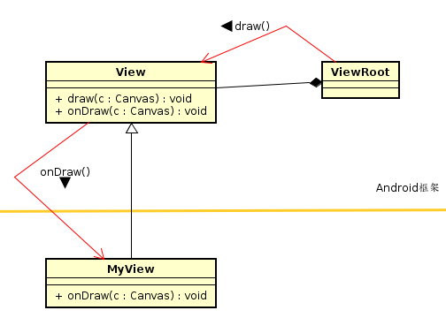
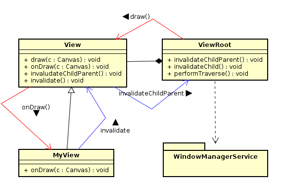
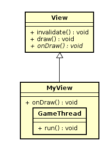
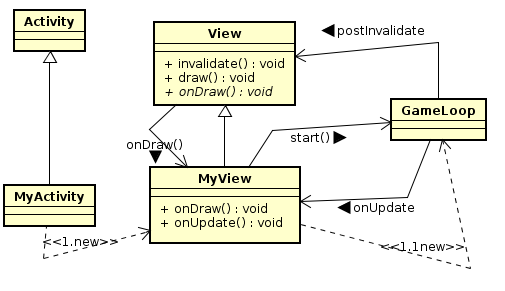

# 1UI线程 View与onDraw()函数



---
# 2基本游戏循环


```java
public class MyView extends View{
  private Paint paint = new Paint();
  private int line_x = 100,line_y = 100;
  private float count = 0;

  ...

  @override
  protected void onDraw(Canvas canvas){
    super.onDraw(canvas);
    ...画图
    try{
      Thread.sleep(1000);
    }catch(Exception e){

    }
    invalidate();
  }
}
```

Android中提供了invalidate来实现画面的刷新；即触发框架重新执行onDraw函数来绘图及显示。



---

# 3使用UI线程的ＭＱ

```java
public class MyView extends View{
  h = new MyHandler();
  onDraw(Canvas canvas){
    ...
    h.removeMessages(0);
    Message msg = h.obtainMessage(0);
    h.sendMessageDelayed(msg,1000);
  }
  class MyHandler extends Handler{
    @override
    public void handleMessage(Message msg){
      invalidate();
    }
  }
}
```

我们可以透过Message方式来触发UI线程去调用invalidate()函数，而达到重新执行onDraw来进行重复绘图和刷新画面的动作.  
使用sendMessageDelayed函数来暂停一下，延迟数秒后才传递Message给UI线程。　　


# 4诞生一个小线程，担任游戏线程

```java
public class MyView extends View{
  ...
  @override
  protected void onDraw(Canvas canvas){
    ...画图
    MyThread t = new MyThread();
    t.start();
  }

  class MyThread extends Thread{
    public void run(){
      h.removeMessages(0);
      Message msg = h.obtainMessage(0);
      h.sendMessageDelayed(msg,1000);
    }
  }
  private MyHandler h = new MyHandler();
  class MyHandler extends Handler{
    handleMessage(){
      invalidate();
    }
  }
}
```

# 5小线程调用postInvalidate

Android 提供了postInvalidate来代替上面的动作.

```java
public class MyView extends View{
  ...
  class MyThread extends Thread{
    run(){
      postInvalidateDelayed(1000);
    }
  }
}
```

# 6设计一个GameLoop类别



---
我们班将刚才小线程部分独立出来，成为一个独立的类别，统称为游戏线程或者游戏循环  



```java
public class GameLoop extends Thread{
  MyView view;
  GaemLoop(MyView view){
    this.view = view;
  }

  run(){
    view.onUpdate();
    view.postInvalidateDelayed(1000);
  }
}

public class MyView extends View{
  ...
  onUpdate(){
    xxx
  }

  onDraw(){
    ...
    GameLoop loop = new GameLoop(this);
    loop.start();
  }
}
```
