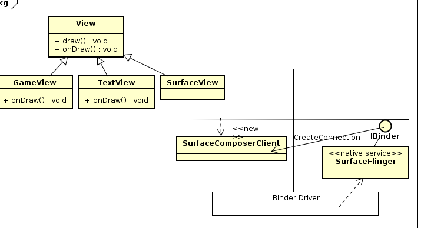
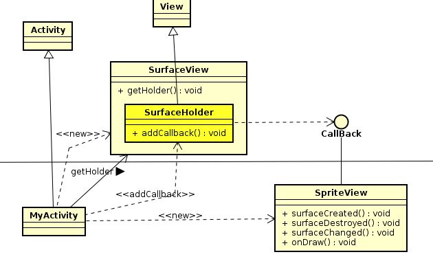

# 1View和SurfaceView之区别

1. SurfaceView是View的子类，其内嵌了一个用于绘制的Surface  
2. 当SurfaceView成为可见时，就会诞生Surface，反之，以便节约资源  
3. 程序里可以控制Surface的大小，SurfaceView可控制Surface的绘图位置  
4. View组件是由UI线程执行，如果需要迅速更新UI线程，或者放置阻止主线程，使用SurfaceView.  
5. SurfaceView可以由背景线程来执行，SurfaceView内含高效率的rendering机制能让背景线程快速更新Surface的内容，适合演示动画　　
6. 可以通过SurfaceHolder接口处理Surface，只要调用getHolder函数就可以取得此接口  
7. 当SurfaceView成为可见时，就会诞生Surface；反之，SurfaceView会被隐藏，就会删除Surface，以便节约资源，当Surface诞生和删除，框架互调SurfaceCreated()和SurfaceDestroyed()函数  



---
# 2使用SurfaceView画２D图

eg1  
1. 以SurfaceView绘制Bitmap图像　　
2. 设计SpriteView类别来实作SurfaceHolder.Callback接口  



```java
//SpriteView
public class SpriteView implements SurfaceHolder.Callback{
  private SpriteThread thread;
  private Paint paint;
  private Bitmap bm;

  public SpriteView(Bitmap bmp){
    bm = bmp;
  }

  @override
  public void surfaceCreated(){
    thread = new SpriteThread(holder,this);
    thread.start();
  }

  @override
  public void surfaceDestroyed(){
  }

  @override
  public void surfaceChanged(SurfaceHolder holder,int format,int width,int height){

  }

  protected void onDraw(Canvas canvas){
    paint = new Paint();
    canvas.drawColor(Color.WHITE);
    canvas.drawBitmap(bm,10,10,paint);
  }

  public class SpriteThread extends Thread{
    private SpriteView view;
    private SurfaceHolder holder;
    private Canvas canvas;

    SpriteThread(SurfaceHolder h,SpriteView v){
      holder = h;
      view = v;
    }

    @override
    public void run(){
      try{
        canvas = holder.lockCanvas(null);
        synchronized(holder){
          view.onDraw(c);
        }
      }finally{
        if(c != null){
          holder.unlockCanvasAndPost(canvas);
        }
      }
    }
  }
}

```

---
