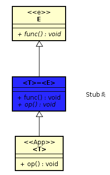
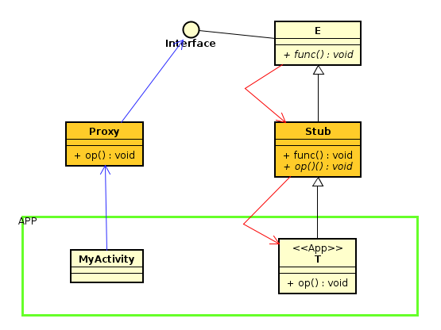
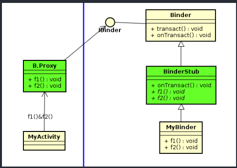
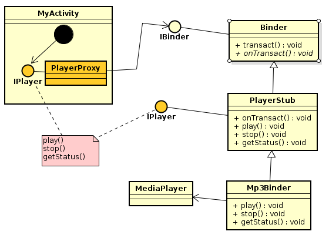

# 1复习：IBinder接口  



---


---


---

# 2IBinder接口的一般用途　　
Android 的IPC框架仰赖单一的Ibinder接口，此时Client端调用IBinder接口的transact()函数，透过IPC机制而调用到远方(Remote)的onTransact()函数　　
在Java层框架里，IBinder接口实现于Binder基类

---
# 3包装IBinder接口--使用Proxy-Stub设计模式
采用Proxy-Stub设计模式将IBinder接口包装起来，让APP与Ibinder接口不在产生高度依赖性。　　
其将Ibnder接口包装起来，转换出更好的新接口  
Proxy类提供了较好的IA接口给Client使用　　
Stub类别则是屏蔽了Binder基类的onTransact()函数，然后将IA接口里的f1和f2函数定义位抽象函数，简化APP开发者的负担　　

# 4谁来写Proxy与Stub类了
```java
public interface IPlayer{
  void play();
  void stop();
  String getStatus();
}

public abstract class PlayerStub extends Binder implements IPlayer{
  @override
  public boolean onTransact(int code,Parcel data,Parcel reply,int flags){
    reply.writeString(data.readString() + "mp3");
    if(code == 1)
      play();
    else if(code == 2)
      stop();
    return true;
  }

  public abstract void play();
  public abstract void stop();
  public abstract String getStatus();
}

public class PlayerProxy implements IPlayer{
  private IBinder ib;
  private String status;

  PlayerProxy(IBinder binder){
    ib = binder;
  }

  public void play(){
    Parcel data = Parcel.obtain();
    Parcel reply = Parcel.obtain();
    data.writeString("playing");
    try{
      ib.transact(1,data,reply,0);
      status = reply.readString();
    }catch(Exception e){
      e.printStackTrace();
    }
  }

  public void stop(){
    Parcel data = Parcel.obtain();
    Parcel reply = Parcel.obtain();
    data.writeString("stop");
    try{
      ib.transact(2,data,reply,0);
    }catch(Exception e){
      e.printStackTrace();
    }
  }

  public void getStatus(){
    return status;
  }

}


  //APP代码
  public class mp3Binder extends PlayerStub{
    ...
    public void play(){
      ...
    }

    public void stop(){
      ...
    }
  }

  public class mp3RemoteService extends Service{
    private IBinder binder = null;

    @override
    public void onCreate(){
      binder = new mp3Binder(getApplication());
    }

    @override
    public void onBind(Intent intent){
      return binder;
    }
  }

  public class Activity01 extends Activity{
    private PlayerProxy proxy;

    onCreate(){
      startService();
      bindService(...);
    }

    private ServiceConnection conn = new ServiceConnection(){
      onServiceConnected(ComponentName className,IBinder binder){
        proxy = new PlayerProxy(binder);
      }
    }

    play(){
      proxy.play();
    }
    stop(){
      proxy.stop();
    }
  }

```



---

# 5谁来写Proxy与Stub类呢
程序生成器 Android的aidl.exe  
