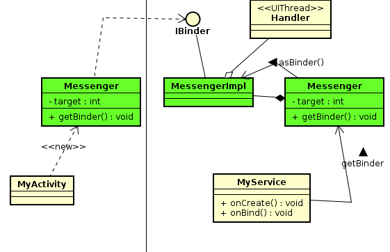

# 2Android的Messenger框架

设计一个Messenger类来包装IBinder接口，让其能跨越进程的将Message对象传递到另一个进程里，给其主线程  
启动，由于Message类实现了Parcelable接口，所以Messenger类可以透过IBinder接口而将Message对象传送到另一个进程里的MessengerImpl类　　
然后，Messenger透过Handler而将Message对象丢入UI线程的MQ里，让UI线程来处理　　

```java
public class MyService extends Service{
  class MyHandler extends Handler{

  }

  final Messenger messenger = new Messenger(new MyHandler());

  onBind(Intent intent){
    return messenger.getBinder();
  }
}

public class Activity01 extends Activity{

  onCreate(){
    ...
  }

  Messenger messenger = null;
  private ServiceConnection conn = new ServiceConnection(){
    public void inServiceConnected(ComponentName className,IBinder ibinder){
      messager = new Messenger(ibinder);
    }
  }

  onClick(){
    Message msg = Message.obtain(null,0,"Hello");
    messager.send(msg);
  }
}
```



---
