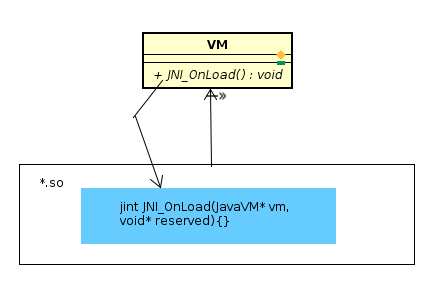

'*.so' 的入口函数JNI_OnLoad()  

用途:
1. VM询问此so文件使用的JNI版本编号。　　
2. VM要求so做一些初期设定工作，例如登记函数名称表　　

当VM释放c模块时，则会调用JNI_OnUnload函数来进行善后清理工作　　

AndroidRuntime::registerNativeMethods()函数向Vm登记gMethods表格，用途有二  
1. 更有效率去找到C函数　　
2. 可在执行期间弹性抽换  
