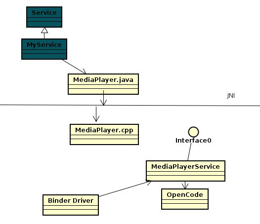

# 1区别核心服务和APP服务
Android 里有2种服务
1. 应用层的应用服务，统称位SDK-based Service  
2. 系统层的核心服务，统称为Core Service  

APP服务是开机完成后，用户加载并开启某APP时，才会启动该APP里的服务，它常会定义成为Service的一个子类别  

在Android开机过程中，就会启动数十个核心服务，当开机完成时，全部核心服务也都启动完成了  

---

# 2回忆APP服务

## 核心服务是系统层的前装型服务
1. 大多以C++类别实现，有些以Java类实现  
2. 可透过ServiceManager来建立和绑定核心服务  
3. 绑定后，可透过IBinder接口去执行其函数  

## App服务是应用层的后装型服务
1. 以Java层的Service的应用子类别实现，所有的APP服务都是由ActivityManagerService核心服务掌管  
2. 在应用层可调用Android框架里Context类别的startService和bindService函数去绑定APP服务。  
3. 绑定后，可透过IBinder接口去执行其函数  

---
# 3区别两种核心服务： Android Service 和Native Service

1. 核心服务可以Java编写，也可以C++编写  
2. 以Java编写的核心服务统称位Android Service（AudioService SensorService)  
3. 以C++编写的核心服务则统称位NativeService（MediaPlayerService,CameraService)  

---
# 4核心服务的特征

# 5简介几个Android Service
