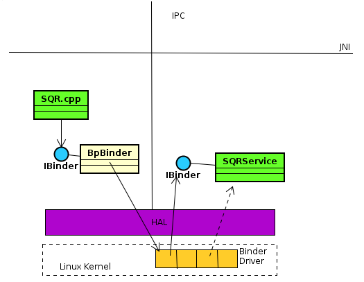

# 1为什么要写核心服务呢？

1. 核心服务是Android框架里最接近Linux/Driver的部分，为了充分发挥硬件设备的差异化特性，核心服务是让上层Java应用程序来使用Driver/HW Device特色的重要管道  
2. 再开机过程中，就可以启动核心服务(例如：汉子输入法服务),让众多应用程序来共享之。  
3. 由于共享，所以能有效降低Java应用程序的大小  

# 2亲自开发一个Native Service： SQRService

此核心服务命名位SQRService,它做简单的整数平方运算，其开发要点为：  
1. 核心服务通常在特定的进程里执行  
2. 必须提供IBInder接口，让应用程序可以进行跨进程绑定和调用  
3. 因为共享，所以必须确保多线程安全  
4. 以C++类定义，诞生其对象，透过SM之协助，将该对象参考值传递给IServiceManager::addService()函数，就加入到Binder Driver里了。  
5. 应用程序可透过SM之协助而远距离绑定该核心服务，此时SM会回传IBinder接口给应用程序。  
6. 应用程序可透过IBinder::transact()函数来与核心服务互传资料  

## 步骤1.编写服务
### 步骤1.1
```c++
//SQRService.h
#include <stdint.h>
#include <sys/types.h>
#include <utils/Parcel.h>

#ifndef ANDROID_MISOO_SQRSERVICE_H
#define ANDROID_MISOO_SQRSERVICE_H
#include <utils.h>
#include <utils/KeyedVector.h>
#include <ui/SurfaceComposerClient.h>
namespace android{
  class SQRService : public BBinder{
  public:
    static int instantiate();
    virtual status_t onTransact(uint32_t,const Parcel&,Parcel*,uint32_t);
    SQRService();
    ~SQRService();
  };
};
#endif

//SQRService.cpp
#include <utils/IServiceManager.h>
#include <utils/IPCThreadState.h>
#include <utils/RefBase.h>
#include <utils/IInterface.h>
#include <utils/Parcel.h>
#include "SQRService.h"

namespace android{
  enum{
    SQUARE = IBinder::FIRST_CALL_TRANSACTION,
  };

  int SQRService::instantiate(){
    LOGE("SQRService instantiate");
    int r = defaultServiceManager()->addService(String16("misoo.sqr"),new SQRService());
    LOGE("SQRService r = %d\n",r);
    return r;
  }

  SQRService::SQRService(){
    LOGE("SQRService created");
  }

  SQRService::~SQRService(){
    LOGE("SQRService desroyed");
  }

  status_t SQRService::onTransact(uint32_t code,const Parcel& data,Parcel* reply,uint32_t flags){
    switch (code) {
      case SQUARE:{
        int num = data.readInt32();
        reply->writeInt32(num * num);
        LOGE("onTransact::CREATE_NUM .. n=%d\n",num);
        return on_ERROR;
      }
      break;
      default:
      LOGE("onTransact::default");
    }
  }
};
```

### 1.2编写make文档
```makefile
//Android.mk
LOCAL_PATH:=$(call my-dir)
include $(CLEAR_VARS)
LOCAL_SRC_FILES:= \
  SQRService.cpp
LOCAL_C_INCLUDES:= \
  $(JNI_H_INCLUDE)
LOCAL_SHARED_LIBRARY:= \
  libutils
LOCAL_PRELINK_MODULE:=false
LOCAL_MODULE:=libSQRS01
incude $(BUILD_SHARED_LIBRARY)
```

### 1.3使用C++编写可独立执行的addservice.cpp程序，此程序先创建SQRService的对象，然后将它加入Binder Driver里  
```c++
//addservice.cpp
#include <sys/types.h>
#include <unistd.h>
#include <grp.h>
...
using namespace android;
int main(int argc,char** argv){
  sp<ProcessState> proc(ProcessState::self());

  sp<IServiceManager> sm = defaultServiceManager();
  LOGI("ServiceManager:%p",sm.get());
  SQRService::instantiate();

  ProcessState::self()->startThreadPool();
  IPCThreadState::self()->joinThreadPool();
}
```

## 2撰写一个本地层的Client
### 2.1使用C++开发一个名位SQR.cpp的C++层用用程序.   
它透过ServiceManager去绑定了SQRService ,然后调用IBinder::transact函数，进而调用SQRService核心服务的onTransact去进行平方的服务  



```c++
//SQR.h
#ifndef xxx
#define xxx
namespace android{
  class SQR{
  private:
    const void getSQRService();
  public:
    SQR();
    int execute(int n);
  }
}
#endif

//SQR.cpp
#incude "SQR.h"
...

namespace android{
  sp<IBinder> m_ib;
  SQR::SQR(){
    getSQRService();
  }
  const void SQR::getSQRService(){
    sp<IServiceManager> sm = defaultServiceManager();
    m_ib = sm->getService(String16("misoo.sqr"));
    LOGE("SQR::getSQRService %p\n",sm.get());
    if(m_ib == 0){
      LOGW("SQRService not published.waiting...");
    }
    return;
  }

  int SQR::execute(int n){
    Parcel data,reply;
    data.writeInt32(n);
    LOGE("SQR::execute\n");
    m_ib->transact(0,data,&reply);
    int num = reply.readInt32();
    return num;
  }

}
```

# 4编写Java层CLient来使用核心服务  
### 3.1使用C语言编写JNI Native module，来当做Java应用程序与SQR.cpp之间的桥梁  

```c++
SQR* sqrObj = new SQR();
int num = sqrObj->execute(x);
```
